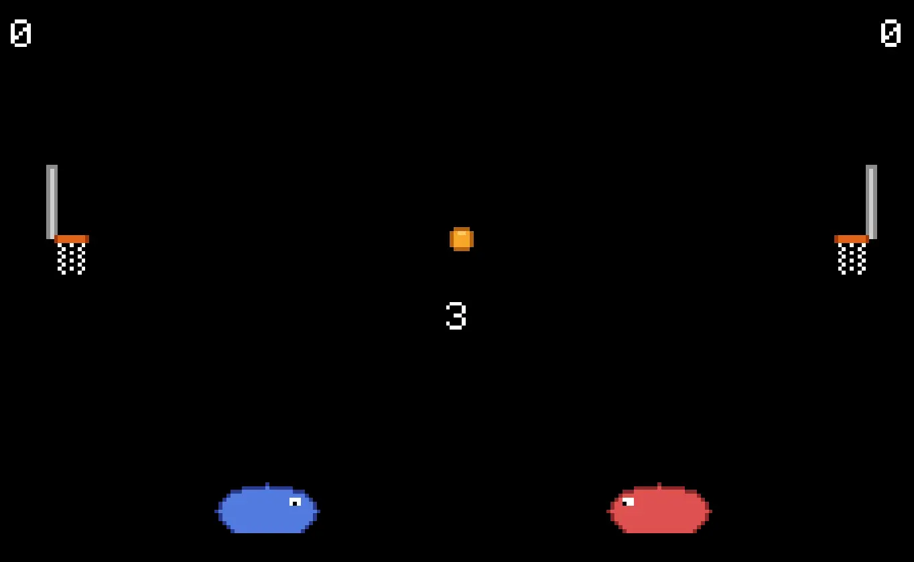

# Hoopblob

A GBA basketball game built with the [Butano](https://github.com/GValiente/butano) engine.

Two semicircle-shaped blobs face off on a side-view court, bumping a bouncing ball into each other's hoops. You play on the left against an AI opponent on the right. First to 10 points wins.



## Controls

- D-pad left/right — Move
- A — Jump
- D-pad up/down — Navigate menus
- A — Select menu option
- B — Back (credits screen)
- Start — Return to menu (game over screen)

## Building

Requires [devkitPro](https://devkitpro.org/wiki/Getting_Started) with the GBA development tools.

```bash
# Install devkitPro (macOS/Linux)
curl -L https://apt.devkitpro.org/install-devkitpro-pacman | bash
sudo dkp-pacman -S gba-dev

# Set environment
export DEVKITPRO=/opt/devkitpro
export DEVKITARM=/opt/devkitpro/devkitARM
export PATH=$DEVKITPRO/tools/bin:$DEVKITARM/bin:$PATH

# Build
make -j$(nproc)
```

This produces `hoopblob.gba` in the project root. Run it with any GBA emulator (e.g. [mGBA](https://mgba.io/)).
